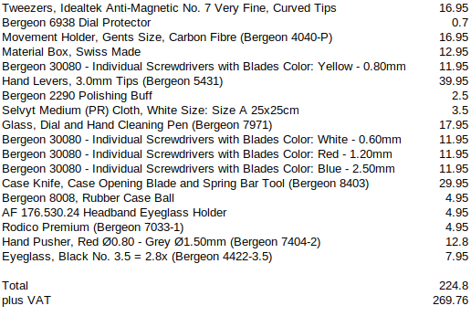

# POSH BOYS WATCH CLUB
Society for the preservation, promotion and pure pleasure of watches.

Contact: support@poshboys.club

## Microbrands
- [Christopher Ward](https://www.christopherward.com/)
- [Studio Underd0g](https://underd0g.com/) -- Seagull
- [Farer](https://farer.com/)
- [Shoreham](https://www.shorehamwatches.com/) -- NH35A
- [Spinnaker](https://spinnaker-watches.com/) -- NH35
- [Forge and Foster](https://forgeandfoster.com/) -- Seagull
- [DIY Watch Club](https://shop.diywatch.club/)
- [Giuliano Mazzuoli](https://giulianomazzuoli.com/)
- [BA111OD](https://ba111od.com/)
- [Seiko 5 mods](https://www.namokimods.com/)
- [Kopf](http://kopf.watch/)
- [Minhoon Yoo](https://minhoonyoo.com/)
- [The Camden Watch Company](https://www.camdenwatchcompany.com/)

## Watches you should have bought
But are sold out now so tough.

- [Christopher Ward Bel Canto](https://www.christopherward.com/c1-bel-canto-blue.html)
- [Studio Underd0g Go0fy Panda (Gen2)](https://underd0g.com/products/01gpb)

## Straps and bracelets
- [Gleave London](https://gleave.london/straps/) -- inexpensive leather straps
- [Barton](https://www.bartonwatchbands.com/) -- low- to mid-priced (also Horween leather)
- [Strap Tailor](https://thestraptailor.com/) -- mid- to high-priced straps
- [Strap Bandits](https://www.strapbandits.com/) -- mid-priced fabric straps
- [Watch Gecko](https://www.watchgecko.com/)
- [Welwyn](https://welwynwatchparts.co.uk/collections/leather-straps) - low- to mid-priced

### High end
- [Forstner](https://forstnerbands.com/) -- steel bracelets
- [Vulcain](https://www.vulcanwatchstraps.com/) -- Rolex rubber straps
- [Rubber B](https://rubberb.com/) -- rubber straps
- [Everest](https://www.everestbands.com/)

## Stores
- [Chrono24](https://www.chrono24.co.uk)
- [Watchfinder](https://www.watchfinder.co.uk)
- [Teddy Baldasssarre](https://teddybaldassarre.com)
- [Pride and Pinion](https://prideandpinion.com)
- [Delray Watch](https://delraywatch.com)
- [Watches of Switzerland](https://www.watches-of-switzerland.co.uk/)
- [The Timeteller shop](https://thetimetellershop.com/)

## Films
- [The Watchmaker's Apprentice](https://www.imdb.com/title/tt2958390/) -- featuring George Daniels and Roger W. Smith

## Price trackers
- [Watch Charts](https://watchcharts.com/)

## Cleaning
- [Polywatch](https://www.polywatch.de/) -- acrylic crystal polish
- [Nanoclear](https://nanoclear.com/)

## Getting on the Rolex waiting list
See [this article](https://www.vulcanwatchstraps.com/blog/how-to-beat-the-rolex-waiting-list).

- Meet with multiple dealers
- Some value purchase history, some value relationships
- Set up appointments and multiple ADs and assess which store is best
- Work your way up
- Only buy what you love, don't fall for dealer tricks
- Grow the relationship, be the person they want to call

---

# Watchmaking
Take it to the next level by repairing and servicing your own watches; but be
warned: the rabbit hole goes __deep__...

## Books
- Practical Watch Repairing -- Donald de Carlo
- Lessons in Horology -- Grossman 
- Practical Treatise on Gearing -- Brown and Sharpe 
- [A Man and His Watch](https://www.waterstones.com/book/a-man-and-his-watch/matthew-hranek/9781579657147) (Paul Newman's Daytona) -- Matthew Hranek

## YouTube channels
- [Wristwatch Revival](https://www.youtube.com/c/wristwatchrevival)
- [Nekkid Watchmaker](https://youtube.com/@NekkidWatchmaker)

## Beat frequencies
|Beats per second | Vibrations per hour |
|---|---|
| 3	  | 10800 |
| 4	  | 14400 |
| 5	  | 18000 |
| 5.5 	  | 19800 |
| 6	  | 21600 |
| 7	  | 25200 |
| 8	  | 28800 |

## Tools
There are myriad tools that can streamline your workflow; I've listed them in
order so you can add as you progress. And tools can be resold quite easily if
you've gone far enough to scratch the itch.

Always to use the correct size screwdriver. You just risk chewing up the
blades, screw head or both.

### Inspection
- Eyeglass, Black No. 3.5 = 2.8x (Bergeon 4422-3.5)
- Selvyt Medium (PR) Cloth, White

### Maintenance
- Spring bar tool (kit)
- Polywatch (cleaning acrylic crystals)
- Pin pusher (adjusting bracelets)
- Bergeon 2290 Polishing Buff

### Exploratory
- Squishy ball case back remover
- Case knife (pen knife) (kit)
- Case knife (oyster shucker style) (kit)
- Rodico Premium (Bergeon 7033-1)
- Eyeglass, Black No. 2.5 = 4x (Bergeon 4422-2.5)
- AF 176.530.24 Headband Eyeglass Holder

### Repair
- Materials box / cloche
- Movement holder
- Bergeon 30080 screwdriver with blades (white 0.6mm)
- Bergeon 30080 screwdrivers with Blades (yellow 0.8mm)
- Bergeon 30080 Screwdrivers with Blades (red 1.2mm)
- Screwdriver Ø1.60mm Bergeon 30080-H - HS1416 (HS1416) 
- Dial protector
- Bergeon hand levers (£40!)
- Hand levers (cheap eBay)
- Bergeon 7404-2 hand pusher (red 0.8mm / grey 1.5mm) -- haven't needed any other size so far!
- Crown pinion remover (can be very expensive for such a specific tool)
- \#2 tweezers
- Plastic pointy stick / peg wood
- Barrel press (cheap) £5
- Case Cushion Watch Black Gel Ø75mm Bergeon 5395-75-N - HC5395-75-N (HC5395-75-N) 

### Servicing
Servicing usually goes hand-in-hand with the strip-down and repair but it can
also start to become quite expensive; not only in the machines but consumables
that you probably can't sell on quite as easily.

But do consider an ultrasonic cleaner, like [this
one](https://www.amazon.co.uk/DK-SONIC-Household-Ultrasonic-Eyeglasses/dp/B08S6V52MV/).
Very reasonably-priced and cool to use.

### Degreaser
Be careful putting your pallet forks in solvent as it can disolve the shellac
that holds the pallet jewels in place.

- Lighter fluid (readily available from a newsagent £2.99)
- Renata essence £8

### Lubrication
A very complicated business, but basically you need:
- A light oil for the quickest moving parts (jewels)
- A slightly heavier oil for the metal-on-metal parts
- And a grease on the high-friction components (e.g., keyless works)

## Pro tools and supplies
- [Lucius Atelier](https://luciusatelier.com/)
- [Gleave London](https://gleave.london/straps/)
- [Eternal tools](https://www.eternaltools.com/)
- [H&S Walsh](https://www.hswalsh.com/)
- [DIY Watch Club](https://shop.diywatch.club/collections/watchmaking-tools)
- [Cousins](https://www.cousinsuk.com)
- [Welwyn](https://welwynwatchparts.co.uk/)

## Enthusiast tools
- [Everest](https://www.everestbands.com/collections/watch-tools-springbars)
- [Barton](https://www.bartonwatchbands.com/en-gb/collections/watch-band-hardware)

