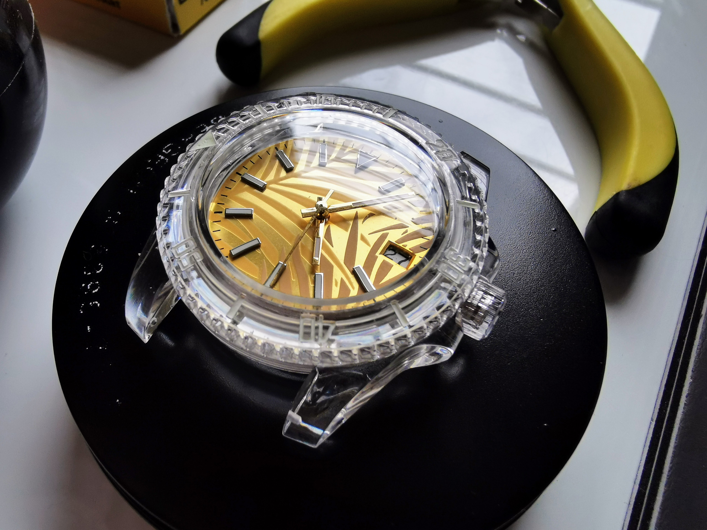
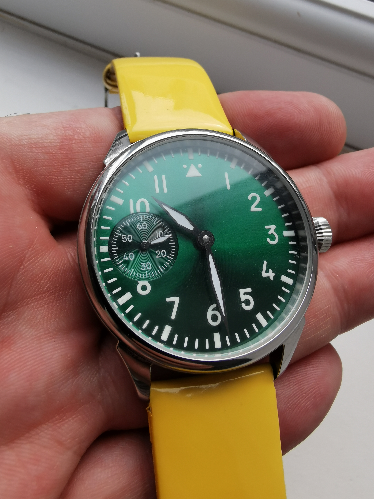

# Complete

Finished builds and required tools.

## Molniya 3602: "White Lightning" -- 12 January 2024

Marriage of an 1980s Molniya 3602 movement (serial 595600) with a new case, dial and hands. And the company actually still makes something similar in their [Tribute series](https://molniya-watches.com/shop/tribute-1984-2-0-1-black-tcb/); the latest is based on the 3603 which has shock protection.

> The Molnija movement is basically a copy of a Cortebert movement as used e.g in Rolex watches from around 1940. The Russians improved accuracy of the movement quite a bit when they upgraded it to their 18 jewels version of the movement but the basic design remained the same until the closure of the factory in 2007.

- [Case and hands set](https://www.ebay.co.uk/itm/266415685911)
- [Example donor movement search](https://www.ebay.co.uk/sch/i.html?_nkw=molnija+3602)
- [Alternative black case](https://www.ebay.co.uk/itm/266402331767)

This was a really interesting return to where it began for me two years ago. The 3602 was the first movement I fully stripped down and rebuilt, and I've built up a nice collection of spares.

I swapped the dial out for the one I discounted at the time and found the hour hand was so flush to the dial I'm surprised it ran at all. On closer inspection I found the hour wheel tube to be very short. 

<!--
I've picked up a few of these and interestingly they have a few different lengths. Similarly, the seconds hand post varies a little.

They very often have broken balance wheels so if you can fix them you are onto a winner; consequently you may have to buy a few donors to make a good one.
-->

### Tools

- Tweezers (Dumoxel Non Magnetic Tweezers with Boxwood Tips)
- Tweezers (Idealtek anti-magnetic number 7 very fine, curved tips)
- Eye glass x4 (Bergeon 4422-2.5)
- Eye glass wire
- Screwdriver yellow 0.8mm (Bergeon 30080)
- Screwdriver red 1.2mm (Bergeon 30080)
- Screwdriver blue 2.5mm (Bergeon 30080): the case screws are big boys!
- Rodico (Bergeon 7033-1)
- Finger cots (Bergeon 7968-18)
- Hand Levers, 3.0mm Tips (Bergeon 5431): these are expensive, 10th of the price for eBay specials
- Hand pushers 2.0mm, 1.5mm, 0.6mm (set of four from CousinsUK)
- Sharpie, to mark the stem
- Small pliers, to hold the square section of the stem whilst unscrewing the crown and also to cut the stem
- Polishing buff or needle file, to refine the stem after cutting (Bergeon 2290)
- Case cushion, black gel Ø75mm (Bergeon 5395-75-N)
- Blower
- Pin vice, for holding the stem
- Cloche
- Case knife

### References

- [Molnija 3601 3602 3603 differences](https://www.thewatchforum.co.uk/threads/molnija-3601-3602-3603-differences.59492/)
- [Linux Focus: comprehensive article on the history of the movement](http://cgi.linuxfocus.org/~guido/molnija-pocket-watch/)

## ST3621: "Red hand... spells DANGER!" -- 7 December 2023

A Seagull clone of the 6498. It sounds like a rework of the 6497, putting the seconds at 6 o'clock; but the movement is actually a little more open -- you can see the escape wheel nicely -- and this clone has more interesting finishing.

- [ST3621 movement](https://www.ebay.co.uk/itm/353975090330)
- [Black PVD case](https://www.ebay.co.uk/itm/185497907594)
- [Red/blue/yellow hands](https://www.ebay.co.uk/itm/265605795340?var=565394312836)
- [Dial](https://www.ebay.co.uk/itm/155711905599)

I do like this black PVD case, but in hindsight I would go for the slightly larger crown: it's a little tricky to wind and pull out even though I haven't cut the stem right up to the case. And the case clamps are quite fiddly: I find it easier to fit with the movement angled almost vertically, poking the clamp beneath the lip (bend towards the dial) before putting it flat and fitting the screw.

The whole build is around 120 bucks for the parts and I've chucked it on a nice Hirsch strap. I bought three sets of hands so I could use one of each colour: if you're being picky you'll notice the seconds hand is a slight different yellow to the numbers on the dial... but hey, we're amongst friends!

### Tools

Only one screwdriver required for this build to release the stem and fit the case clamps.

#### Not to be skimped on (Swiss)

- Tweezers (you don't need these expensive ones for this job, but they are Dumoxel Non Magnetic Tweezers with Boxwood Tips)
- Bergeon 4422-2.5 eye glass
- Bergeon 8008 squishy ball
- Bergeon 30080 screwdriver, red (1.2mm)
- Bergeon 7033-1 Rodico
- [Moebius Syntalube 9010](https://www.cousinsuk.com/product/moebius-9010-syntalube)
- [Moebius 8300](https://www.cousinsuk.com/product/moebius-8300-all-purpose-favourite)
- Bergeon Oiler, medium (green for the grease)
- Bergeon Oiler, fine (red for the rubies)

#### Can be skimped on (eBay)

- Sealing grease, for gaskets on caseback and crown tube ([CousinsUK](https://www.cousinsuk.com/product/gasket-grease-applicator?code=G36964))
- Finger cots (I use large Bergeon 7968-18)
- Hand pushers (Hand Fitting Tool Set, Deluxe from CousinsUK)
- Eye glass wire
- Sharpie, to mark the stem
- Nippers or side-cutters, to cut the stem to size
- Small pliers, to hold the square section of the stem whilst removing the crown
- Polishing buff or needle file, to refine the stem after cutting (this is a Bergeon 2290)

#### Nice to have

- Case cushion (slightly contentious but you _could_ get away with just a cloth)
- Blower

### Movements references

- [6497 vs 6498](https://calibercorner.com/eta-unitas-caliber-6497-vs-6498/)
- [Omega 2211](https://calibercorner.com/omega-caliber-2211/)
- [6498](https://calibercorner.com/eta-caliber-6498-2/)
- [ST3600](https://calibercorner.com/seagull-caliber-st3600k/)

## NH35A: "B&H Pool Cruiser" -- 27 September 2023

This is my first NH35A build. I just wanted to get a feel for it given the abundance of mod kits for these Seiko movements.

£60 for the parts, probably the same again on tools.

- [Clear diver case](https://www.ebay.co.uk/itm/175384131933)
- [NH35A](https://www.ebay.co.uk/itm/374352507306)
- [Gold dial](https://www.ebay.co.uk/itm/125386605361?var=426399896939)
- [Gold hands](https://www.ebay.co.uk/itm/354891209789?var=624196900074)

Initially I was confused by the dial feet spacing so I removed the plastic movement spacer. _Do not do this!_ Unless you want to disassemble the calendar works to get it back on again. However, having done this, I was surprised to discover how many plastic components are in there.

The dial comes with extra feet for other movements, but these can simply be twisted off with an old pair of blunt tweezers. This does leave little nubs that will stop the dial laying flat but the dial is soft and they can quickly be ground off with sandpaper. The feet you need to remove are those with the smallest gap between them.

I have to say, this movement does feel a little cheap compared to an ST3600, say, but it is also pretty rugged. I actually thought I'd broken it putting the dial side back together and then didn't follow the usual precautions: subsequently lost an index and bent a hand... but when I realised what I'd done I popped the cots back on and continued properly! (I'd fitted one of those plastic wheels _upside down_ so you couldn't adjust the hands.) Finally, you don't need the extra movement spacer that came with the case, nor does this movement require a dial washer.

In conclusion: this case looks cool but it feels very poor quality: the bezel tolerance is particularly bad. But it was a fun little project that will stay in the collection.

### Tools

If I hadn't cocked up the spacer I wouldn't have needed a screwdriver at all. (I used a Bergeon 30080 screwdriver, red (1.2mm) to remove the calendar works... although it might actually be a 1.4mm.)

#### Not to be skimped on (Swiss)

- Tweezers (you don't need these expensive ones for this job, but they are Dumoxel Non Magnetic Tweezers with Boxwood Tips)
- Bergeon 4422-2.5 eye glass
- Bergeon 8008 squishy ball
- Bergeon 7033-1 Rodico

#### Can be skimped on (eBay)

- Blunt tweezers, to remove the extra dial feet and hold the square section of the stem (these are brass from a job lot)
- Finger cots (I use large Bergeon 7968-18)
- Hand pushers (Hand Fitting Tool Set, Deluxe from CousinsUK)
- Pointy stick, to release the stem
- Eye glass wire
- Sharpie, to mark the stem
- Nippers or side-cutters, to cut the stem to size
- 600 grit sandpaper, to clean up the stem and remove the extra dial feet

#### Nice to have

- Case cushion (slightly contentious but you _could_ get away with just a cloth)
- Hand levers (assuming you don't get it right first time)
- Baggy, to protect the dial when removing the hands
- Blower
- Polishing buff or needle file, to refine the stem after cutting (this is a Bergeon 2290)

## ST3600: "BigDeano" -- 28 August 2023

_Disclaimer: any resemblance to watches real or imagined is entirely intentional._

You can fund the whole build and tools for not too much over £100.

The ST3600 is an inexpensive but nice-looking ETA 6497 clone. I bought the movement, case, dial and hands separately on eBay. Make sure to buy a 37mm dial and not 38.9mm (which I bought first in error but still used the hands.)

- 16.5''', Dm= 36.6mm, Do= 37.2mm
- H= 4.2mm
- F= 0.5mm
- T= 1.85mm
- 15/17 jewels
- f = 18000 A/h
- power reserve 50h
- Hands 2.00 x 1.15 / 0.27mm

### Components

All sourced from eBay.

- [Steel case](https://www.ebay.co.uk/itm/183588605779?var=690982652345)
- [Hands](https://www.ebay.co.uk/itm/184951851422?var=692737694119)
- [ST3600 movement](https://www.ebay.co.uk/itm/314013048705)
- [Dial](https://www.ebay.co.uk/itm/185468300563?var=693275967599)

### Tools

You don't need many tools for this build... in theory. But I ended up dropping a case clamp into the movement and doing a complete disassembly to retrieve it. And I did this twice! So, if all goes well, here's the minimum set of tools required:

#### Not to be skimped on (Swiss)

- Idealtek anti-magnetic number 7 very fine, curved tips
- Bergeon 4422-2.5 eye glass
- Bergeon 8008 squishy ball
- Bergeon 30080 screwdriver, red (1.2mm)
- Bergeon 30080 screwdriver, pink (1.6mm)
- Bergeon 7033-1 Rodico

#### Can be skimped on (eBay)

- Eye glass wire
- Case cushion
- Sharpie, to mark the stem
- Nippers or side-cutters, to cut the stem to size
- Polishing buff or needle file, to tidy up the stem after cutting (this is a Bergeon 2290)
- Finger cots, large (these are Bergeon 7968-18)
- Hand pushers (I only used the 2mm one)
- Cloche (inexpensive, but you could just use the containers from the hands and dial)

### Notes

Whilst on paper this is a simple build, the case clamps are particularly fiddly and need to be fitted with the movement in the case (unlike a vintage Omega 601, for instance, which can be swung out of the way.) With the movement in the case, really get in with the loupe to understand where the lip of the case is; you can press the movement gently into the case to make a little space for the clamp. And with a bit of luck you'll get the screw in.

Once the balance is spinning, tighten the clamps and make sure it doesn't stop with pressure from compressing the dial.

There is talk of these movements coming out of the factory unlubricated, but that's a whole different story, see [watchmaker resources](watchmaker.md) for an introduction to oiling.

## Omega 131.019 gold-plated

30463681 (1970), cal 601, worn crown, 43-hour power reserve, crystal is loose, case back is a mess, very strong running so might not do a full service.

- [x] Replace case back
- [x] Trial refitting old crystal -- cracked it
- [x] Order new crystal: &#x2300; 30.8mm, 3.5mm height (Sternkreuz Sku: MG3011-308)
- [x] Fit new crystal
- [ ] Measure amplitude 
- [ ] Partial service of keyless works

## Rone 34mm FHF ST-96 11.5'''

I think this might be my rite of passage.

Bought for 25 bucks four months ago, and it _just_ had a slippy mainspring. So,
I attempted a service and immediately the cannon pinion evaporated. Ordered a
donor and broke _two_ escape wheel pinions on the rebuild. OK, ordered a second
doner. When that arrived I serviced the keyless works and sent the yoke spring
into orbit. No worries, I have another... also sent that one to the Moon. But
wait... I found the first on my pants! Right, on the home stretch, located the
case and movement spacer from months previous and it's back together, looking
exactly like it did when I bought it! But I have grown as a human being.

## Raketa 2609.HA 11.5'''

Solid Soviet-era watch, 38mm, just needs a little love.

- [x] Estimate amplitude (slow-mo video): approx 200&deg;
- [x] Potential loose dial (rattles when you tap it but case screws are tight): was missing a dial screw
- [x] Clean dial
- [x] Put case in ultrasonic
- [x] Polywatch crystal

## Mr. Jones "The Accurate"

An actual quartz repair!

£145 RRP -- see [website](https://mrjoneswatches.com/products/the-accurate) --
which is quite surprising given I bought a whole new movement _with_ battery
for £9.

- [x] Replace battery -- still not running
- [x] Ordered new Ronda 513
- [x] Replace coil, hands very difficult to remove
