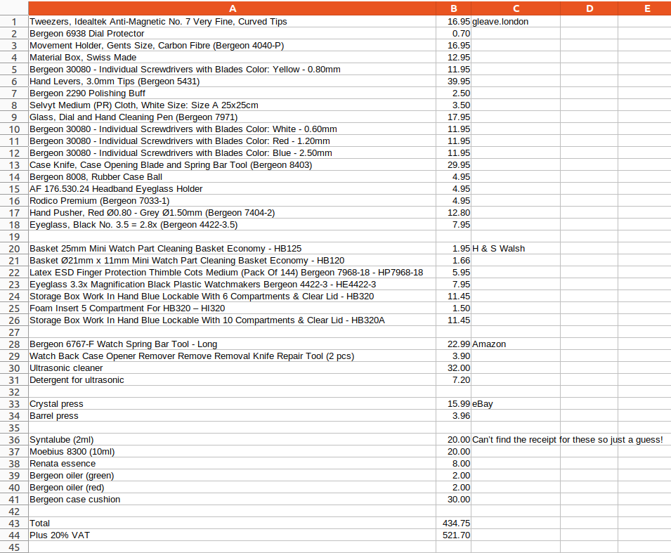

# PBWC

PBWC is a group of like-minded collectors with a common enthusiasm for the preservation, promotion and pure pleasure of watches. Watches transcend art, design, culture, history, jewelry, fashion, mechanics and physics (amongst other things.)

For those who haven't yet accepted their calling as a watchmaker, head over to the [collectors' page](collector.md).

## Tools

There are myriad tools that can streamline your workflow; I've listed them in order so you can add more as you progress. And tools can be resold quite easily if you've gone far enough to scratch the itch.

__tldr: expect to fork out £500 to service a basic watch.__

See the [full spreadsheet](tools.xlsx).

### Inspect

You don't need much to get started -- you're basically just having a closer look -- but I often go out and about with a loupe in my jacket pocket, just in case.

- Eyeglass/loupe 2.8x (Bergeon 4422-3.5): note the Bergeon name is the focal length not the magnification
- Large cleaning cloth (Selvyt Medium White Size: Size A 25x25cm)

### Maintain

Next you might want to replace straps and maybe do a little cleaning and light buffing.

- Spring Bar Tool (Bergeon 6767-F Watch): quite nice to choose straps with quick release spring bars if you can
- Polywatch: acrylic crystal polish
- Polishing buff (Bergeon 2290)

### Explore

Now we're cooking: get the case back off and inspect the insides for any issues.

- Rubber Case Ball (Bergeon 8008): squishy ball case back remover that works far better than you might think
- Case knife: pen knife style
- Case knife: oyster shucker style; I generally prefer these to the pen knife style but it's good to have a choice
- Rodico Premium (Bergeon 7033-1): for picking up dust and small components; often useful for manipulating hands
- Eyeglass/loupe 4x (Bergeon 4422-2.5): slightly more magnification
- Eyeglass Holder (AF 176.530.24): just a loop of spring steel wire that goes around your head, the ones that clip on your glasses look nice but are much more expensive
- Case Cushion (Bergeon Gel Ø75mm): treat yourself to a decent, large gel cushion

### Strip down

This is getting serious... and you'll need quite a few more tools. But you will have enough to completely dismantle a basic movement (and by "basic" I mean a three hand manual winder.) Note we are _replacing_ broken parts at this level, rather than making new ones. Always use the correct size screwdriver: you just risk chewing up the blades,
screw head or both.

- Movement Holder, Gents Size, Carbon Fibre (Bergeon 4040-P): essential and even the Bergeon ones are reasonably-priced
- Tweezers (Idealtek Anti-Magnetic No. 7 Very Fine, Curved Tips): I actually got a job lot of tweezers on eBay but these curved tipped ones are my favourite
- Latex ESD Finger Protection Thimble Cots Medium, Pack Of 144 (Bergeon 7968-18)
- Materials box / cloche: you will never have enough, quite nice to have a whole box for a build or spares of the same movement
- Screwdriver with blades white 0.6mm (Bergeon 30080)
- Screwdriver with Blades yellow 0.8mm
- Screwdriver with Blades red 1.2mm
- Screwdriver with Blades pink 1.6mm
- Dial protector (Bergeon 6938): very cheap, or use the traditional "ripped baggy" (or both)
- Hand Levers, 3.0mm Tips (Bergeon 5431): £40... buying these hurt! I also got some cheap ones from eBay for a 10th of the price and I've since lost one of the Bergeons
- Hand Pusher, Red Ø0.80 - Grey Ø1.50mm (Bergeon 7404-2): I haven't needed any other size so far but fitting hands is still a little hit-and-miss for me
- Cannon pinion remover: can be very expensive for such a niche tool; alternatively do it carefully in a bag with tweezers, I found some blunt end brass ones that work, pull upwards to avoid bending anything
- Plastic pointy stick/peg wood: Starbucks call them "coffee stirrers" but they look like peg wood to me
- Barrel press: eBay £5, if it's good enough for Marshall...
- Crystal press: eBay £15.99, screw down seems a bit more controlled; I also padded the lower dies out with sticky felt furniture pads into a domed shaped

### The next level

Take it to the next level by repairing and servicing your own watches; but know this: the rabbit hole goes __deep__... see where to go from here in [watchmaker's resources](watchmaker.md#clean).
