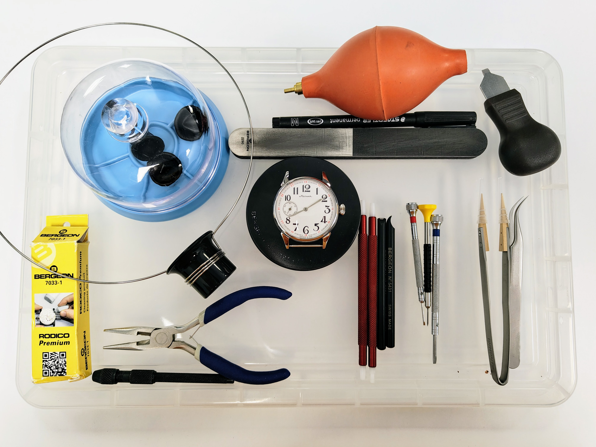

# Tools

There are myriad tools to streamline your workflow, I've listed them in order so you can add more as you progress; and tools can be resold quite easily if you've gone far enough to scratch the itch.

Optics, tweezers and screwdrivers can't be skimped on. If you can justify a full set of Bergeon screwdrivers on the little carousel that's great and cost-effective, otherwise just pick up the three or so essentials and buy the rest as you go.

__Expect to fork out £500 to service a basic watch.__

<!--
| Item | Price |
| ---- | ----- |
| Tweezers, Idealtek Anti-Magnetic No. 7 Very Fine, Curved Tips	 | 16.95 |
| Bergeon 6938 Dial Protector |	0.70 |
| Movement Holder, Gents Size, Carbon Fibre (Bergeon 4040-P) | 16.95 |
| Material Box, Swiss Made | 12.95 |
| Hand Levers, 3.0mm Tips (Bergeon 5431) | 39.95 |
| Bergeon 2290 Polishing Buff | 2.50 |
| Selvyt Medium (PR) Cloth, White Size: Size A 25x25cm | 3.50 |
-->

## Inspect

You don't need much to get started -- you're basically just having a closer look -- but I often go out and about with a loupe in my jacket pocket. You know... just in case.

| Product | Description | Price |
|---|---|---|
| Eyeglass/loupe 2.8x (Bergeon 4422-3.5) | The Bergeon name is the focal length not the magnification | 7.95 |
| Large cleaning cloth (Selvyt Medium White Size: Size A 25x25cm) | I think it's good practice to always handle watches with a cloth, especially if it's not yours; a decent microfibre cloth is a good alternative | 5 |
| Spring Bar Tool (Bergeon 6767-F) | It's really nice to choose straps with quick release spring bars if you can, otherwise this tool is essential | |

## Vintage clean and restore

Tidy up an old case and crystal.

| Product | Description | Price |
|---|---|---|
| Polywatch | Acrylic crystal polish: vintage crystals, won't touch mineral glass | 10 |
| Polishing buff (Bergeon 2290) | For steel cases, don't use on gold-plated or it won't be gold-plated for much longer | 8 |
| Rodico Premium (Bergeon 7033-1) | For picking up dust and small components; also useful for manipulating hands into position, a little Rodico on the end of a closed oil dropper is my go-to | 5 |
| Crystal press | The screw down type seems a bit more controlled; I also padded the lower dies out with sticky felt furniture pads into a dome shape | 16 |
| TOTAL | | TBD |

## Explore

Now we're cooking: get the case back off and inspect the insides for any issues.

| Product | Description | Price |
|---|---|---|
| Rubber Case Ball (Bergeon 8008) | Squishy ball case back remover that works far better than you might think | 5 |
| Case knife | Pen knife style and oyster shucker style; I generally prefer the oyster-style but it's good to have a choice | 5 |
| Eyeglass/loupe 4x (Bergeon 4422-2.5) | Slightly more magnification | 8 |
| Eyeglass Holder (AF 176.530.24) | It's just a loop of spring steel wire that goes around your head, the ones that clip on your glasses look nice but can be more expensive; I tend to swap between depending how I'm feeling, eye glasses can get a little steamy too! | 5 |
| Case cushion (Bergeon 5395-75-N) | Treat yourself to a decent, large gel cushion | 15 |
| TOTAL | | 38 |

## Strip down

This is getting serious... and you'll need quite a few more tools. But you will have enough to completely disassemble a basic movement (and by "basic" I mean a three hand manual winder). Note we are _replacing_ broken parts at this level, rather than making new ones. And always use the correct size screwdriver, otherwise you just risk chewing up the blades, screw head or both.

| Product | Description | Price |
|---|---|---|
| Movement Holder, Gents Size, Carbon Fibre (Bergeon 4040-P) | Essential and even the Bergeon ones are reasonably-priced | 20 |
| Tweezers (Idealtek Anti-Magnetic No. 7 Very Fine, Curved Tips) | I actually got a job lot of tweezers on eBay but these curved tipped ones are my favourite | 17 |
| Latex ESD Finger Protection Thimble Cots Large, Pack Of 144 (Bergeon 7968-18) | The sizing of these is a bit of a mystery, I've never thought I had particularly big hands but anything smaller than large is unbearable and even they are a little tight on the thumbs | 5 |
| Cloche | You will never have enough pots to store things | 5 |
| Screwdriver with blades yellow 0.8mm (Bergeon 30080) | | 12 |
| Screwdriver with blades red 1.2mm | | 12 |
| Screwdriver with blades pink 1.6mm | | 12 |
| Dial protector (Bergeon 6938) | Very cheap, or use the traditional "ripped baggy"; I've found that hands can sometimes ping off so the baggy does at least prevent that; be careful with applied indices as they're quite easy to un-apply | 1 |
| Hand Levers, 3.0mm Tips (Bergeon 5431) | £40... buying these hurt! I also got some cheap ones from eBay for a 10th of the price | 40 |
| Hand pushers | Pack of 4 from Cousins | 5 |
| Barrel press | eBay £5, if it's good enough for Marshall... | 5 |
| Sealing Grease Winder | For gaskets on case back and crown tube; a nice little finishing flourish | 5 |
| Cannon pinion remover | Can be very expensive for such a niche tool; alternatively do it carefully in a bag with tweezers, I found some blunt-end brass ones that work, pull upwards to avoid bending anything | |
| Plastic pointy stick/peg wood |Starbucks call them "coffee stirrers" but they look like peg wood to me | 0 |
| Total | | 217 |

## Cutting stems

| Product | Description | Price |
|---|---|---|
| Nippers | You can cut the stem with regular pliers but you'll make a better job of it with end cutters | 10 |
| Emery sticks (assorted) | To refine the cut stem, you can get away 800 grit paper | 7 |
| Pin vice | To hold the stem when you're polishing it | 4 |
| Total | | 21 |

## The next level

Take it to the next level by repairing and servicing your own watches; but know this: the rabbit hole goes _deep_... see where to go next in [watchmaker's resources](watchmaker.md#clean).
